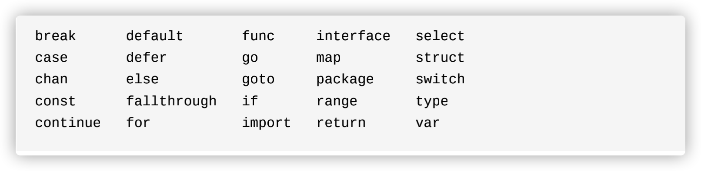
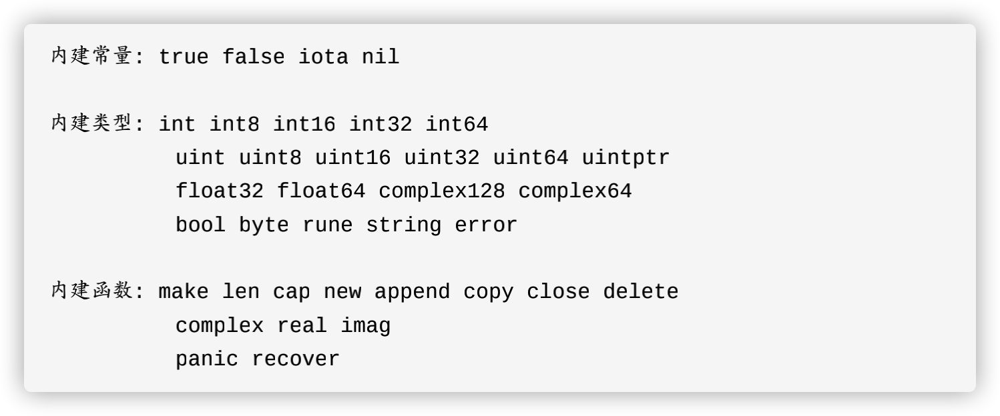

# Go语言结构


# Go程序结构

## 1.命名

​		Go语言中的函数名、变量名、常量名、类型名、语句标号和包名等所有的命名，遵循如下命名规则:

​		即必须以一个字母或下划线开头，后面可以跟任意数量的字母、数字或下划线。并且命名**区分大小写**，且不能为Go语言中的关键字并且要尽量避开预定义的名字，如下图：





​		在Go中，命名可以影响到该变量的可见性。对于包级名字来讲，若该变量命名首字母大写，则此变量相对其他.go文件是可导入的，如果为小写，相对于其他.go文件则是不可导入的。可以对比Java中的public与private进行理解。

## 2.声明

​		Go中主要有四种类型的声明语句:var、const、type、和func，分别对应变量、常量、类型和函数实体对象的声明。

​		常量声明:

```go
	   const LENGTH = 1
```

​		变量声明:

```go
	   var 变量名 类型 = 表达式

​		var i,j,k int  //i,j,k均为int类型,且取值对应int零值->0

​		var b,f,s = true,2.3,"four" //变量类型依次为bool,float64,string
```

​		在函数内部，还可以通过简短变量声明的形式初始化局部变量:

```go
		length := 1 //等价于两条语句 1-声明变量 2-给变量赋值
```

​		创建变量还可以通过内建的new函数：

```go
		p := new(int)    //*int类型的p，指向匿名的int变量

​		fmt.Println(*p) //0

​		*p = 2。//2

​		fmt.Println(*p) // 2
```

​		创建一个新的类型，使用如下的语句:

​		type 类型名字 底层类型

​		如下，分别创建Celsius和Fahrenheit类型

```go
		type Celsius float64    //摄氏温度

​		type Fahrenheit float64 //华式温度
```


